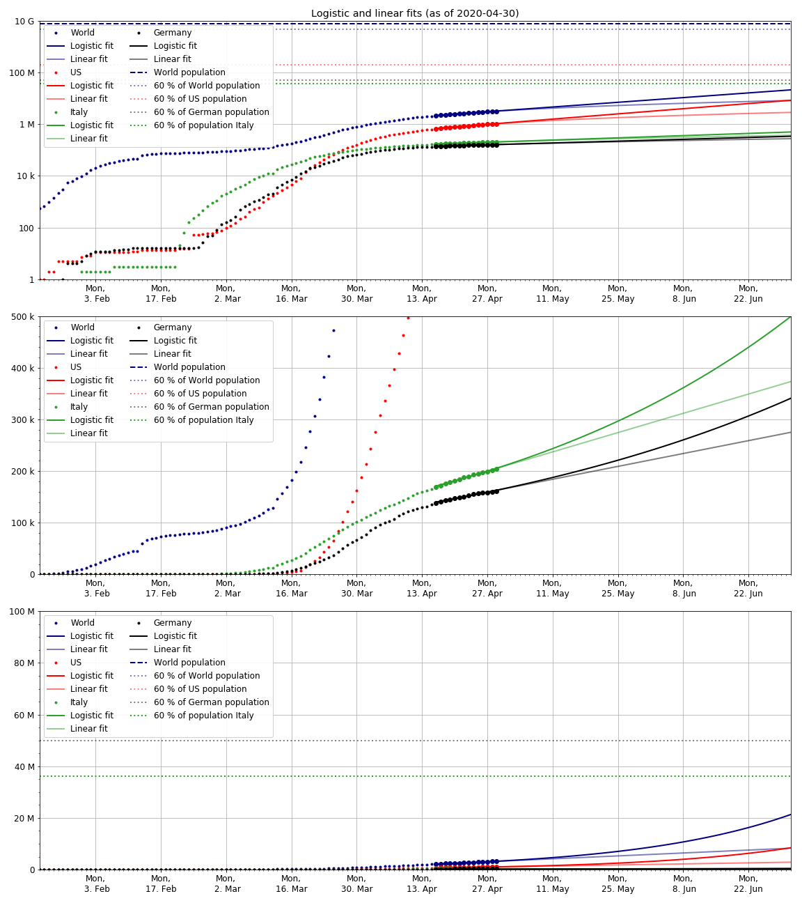

2020-04-01 updated by Malte Venzmer

# Covid-19 prediction plots

- [website](https://ecbo2000.net:17000/malte_site/covid19/covid19.html)
- [GitHub](https://github.com/Maltev-git/Covid19-plots)

The growth is no longer exponential in some regions but rather linear. It appears that the implemented measures decrease the infection rate. The fit curves are based on the current data, so they are estimates for an unchanged situation.

Data source: 2019 Novel Coronavirus COVID-19 (2019-nCoV) [Data Repository](https://github.com/CSSEGISandData/COVID-19) by Johns Hopkins CSSE.

### Case history

### Logistic fit up to 70 % of region's population

Reason for 70% limit: One infected person spreads it on average to 3 others. If 2 of 3 (67%) have it already, the number of active cases stays constant.
Source: [Government press conference (2020-03-11)](https://www.bundesregierung.de/breg-de/themen/coronavirus/merkel-zu-corona-1729780).

### Prediction for Germany

The median time between onset of symptoms and death is 8-12 days, according to sources cited in Wikipedia. A delay value of 10 days is used in these plots and a case fatality rate of 2.3 %.

There are a total of 28.000 intensive care unit (ICU) beds in Germany, according to [Statistisches Bundesamt](https://www.destatis.de/DE/Presse/Pressemitteilungen/2020/03/PD20_N011_231.html).

There are 4814 ICU beds that are available within 1 day (as of 2020-03-20), according to [DIVI](https://www.divi.de/aktuelle-meldungen-intensivmedizin/covid-19-erste-daten-fuer-die-anzahl-von-patienten-sowie-verfuegbaren-intensivbetten).

### Progress of flattening the curve in Germany

