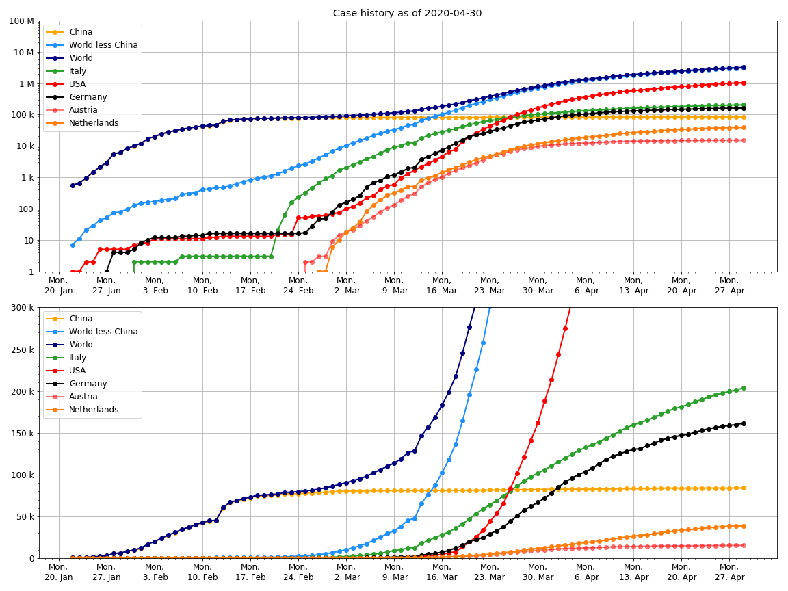
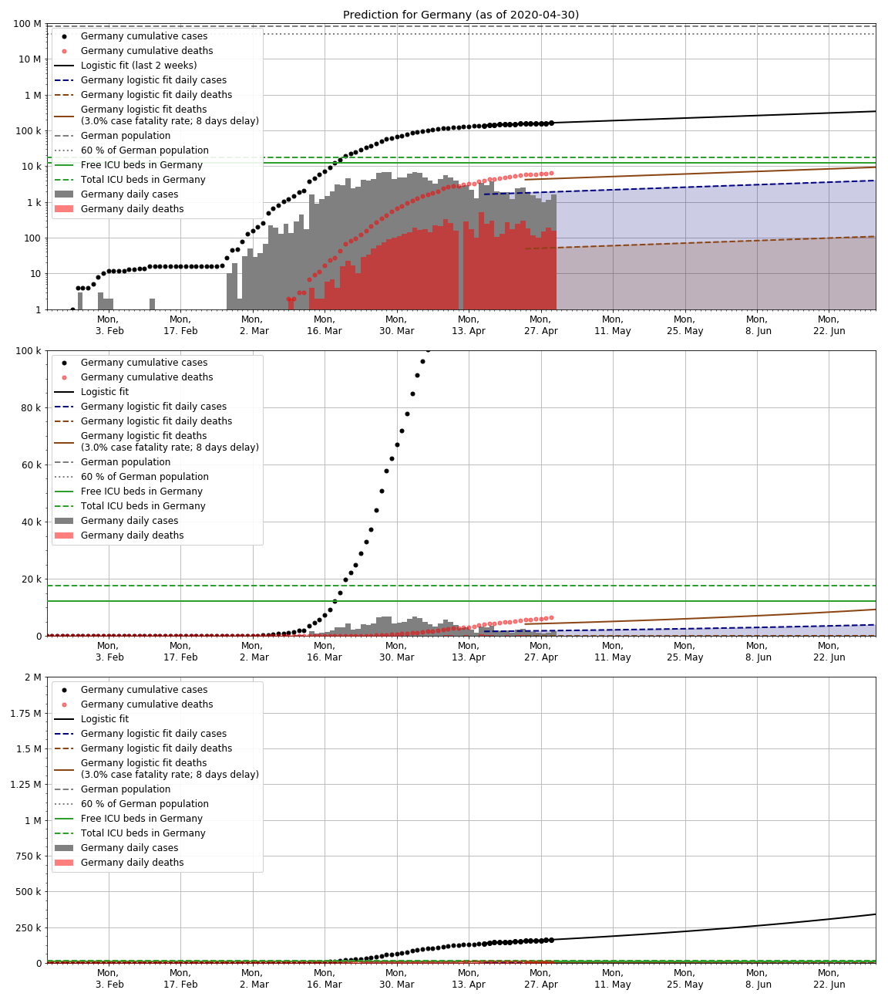
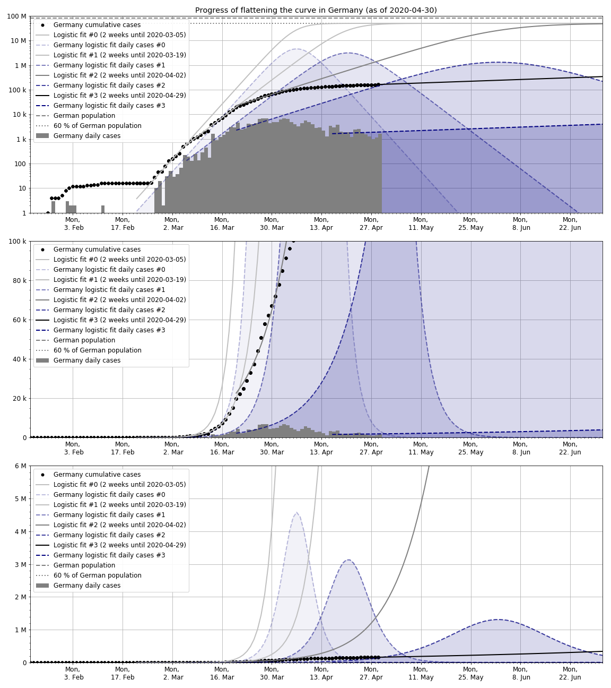

2020-04-08 updated by Malte Venzmer

# Covid-19 prediction plots

- [website](https://ecbo2000.net:17000/malte_site/covid19/covid19.html)
- [GitHub](https://github.com/Maltev-git/Covid19-plots)

The growth is no longer exponential in some regions but rather linear. It appears that the implemented measures decrease the infection rate. The fit curves are based on the current data, so they are estimates for an unchanged situation. Update 2020-04-02: Now, the current fit curves are based on data from the last two weeks.

Data source: 2019 Novel Coronavirus COVID-19 (2019-nCoV) [Data Repository](https://github.com/CSSEGISandData/COVID-19) by Johns Hopkins CSSE.

Update 2020-04-06: The [Priesemann research group](http://www.viola-priesemann.de/group/) from Göttingen Campus works on [COVID-19 forecast models](https://goettingen-campus.de/research/szenarien-covid-19) based on bayesian inference. They also analyze the impact that governmental policy changes have ([GitHub](https://github.com/Priesemann-Group/covid19_inference_forecast)).

### Case history

### Logistic and linear fit up to 60 % of region's population

**Update 2020-04-08:** Added a linear fit curve, which fits better now for some regions.

Update 2020-04-06: One infected person spreads it on average to 2-3 others, according to the [European Centre for Disease Prevention and Control](https://www.ecdc.europa.eu/en/covid-19/questions-answers).

So let's say if 1.5 of 2.5 people (60%) have it already, the number of active cases stays constant.

### Prediction for Germany

The median time between onset of symptoms and death is 8-12 days, according to sources cited in Wikipedia.

Update 2020-04-02: In order to replicate the fatality counts more accurately, I reduced the death delay duration from 10 to now 8 days and increased the case fatality rate from 2.3 % to 3.0 %.

Update 2020-04-06: There are a total of 23.420 intensive care unit (ICU) beds in Germany and thereof 10.064 are free, according to [DIVI-IntensivRegister Tagesreport 2020-04-04](https://www.divi.de/images/Dokumente/DIVI-IntensivRegister_Tagesreport_2020_04_04.pdf).

### Progress of flattening the curve in Germany

